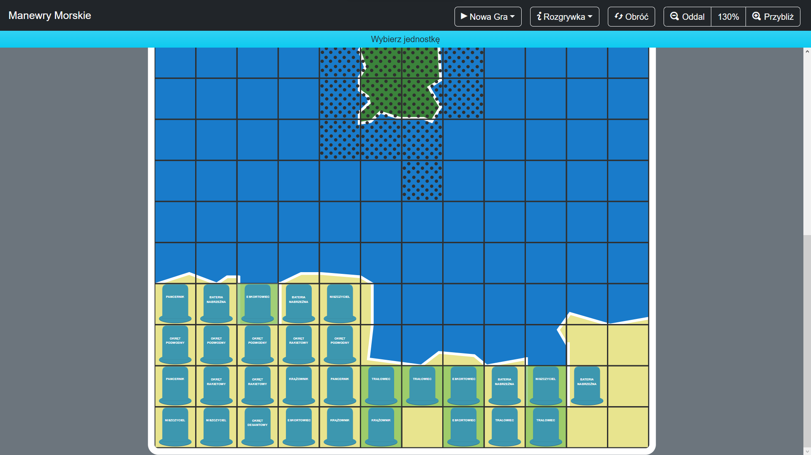
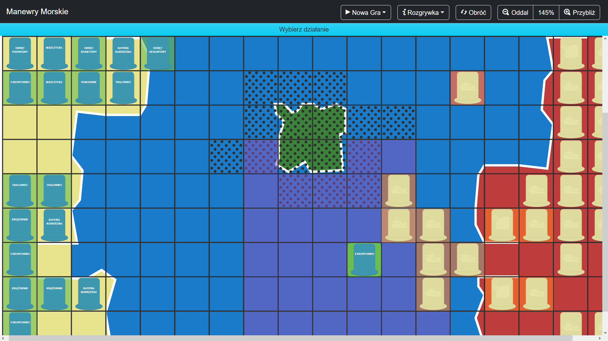

# Manewry Morskie

Gra planszowa [*Manewry Morskie*](http://www.nostalgia.pl/manewry-morskie) odtworzona w formie aplikacji webowej oraz aplkacji multiplatformowej na systemy Android, iOS, macOS i Windows umożliwająca rozgrywkę online lub w trybie "Hot Seat".
Rozwiązanie zaimplementowane przy pomocy technologii Blazor, ASP .NET Core, SignalR oraz MAUI Blazor Hybrid ze środowiska .NET

[Web App Demo](https://manewry-morskie.pl)

### Zrzuty ekranu

